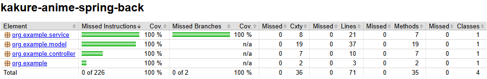
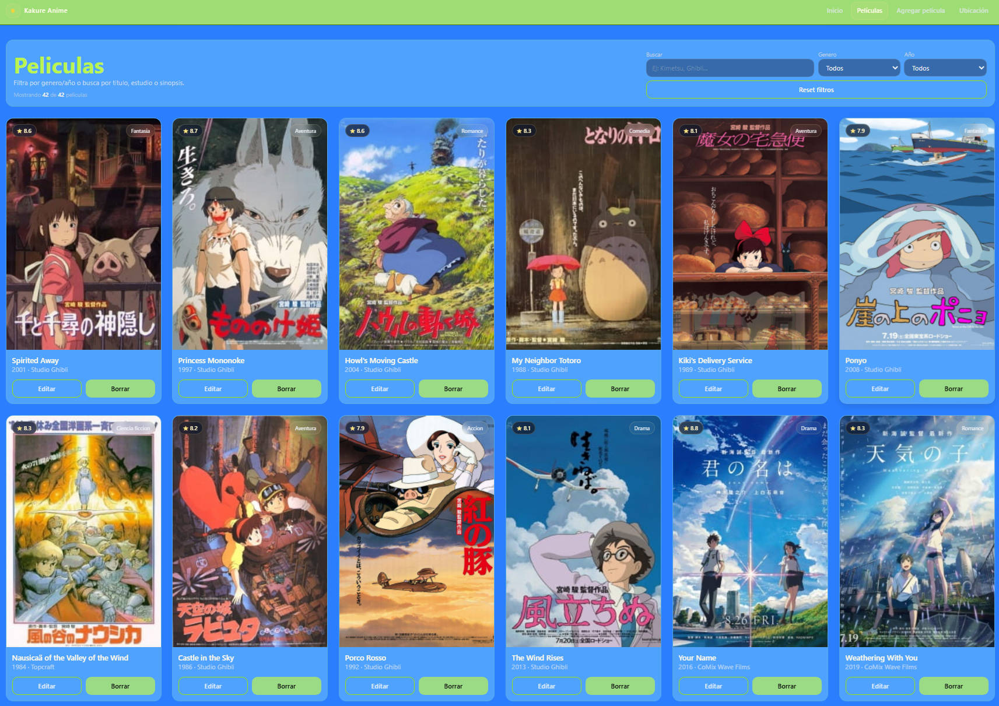
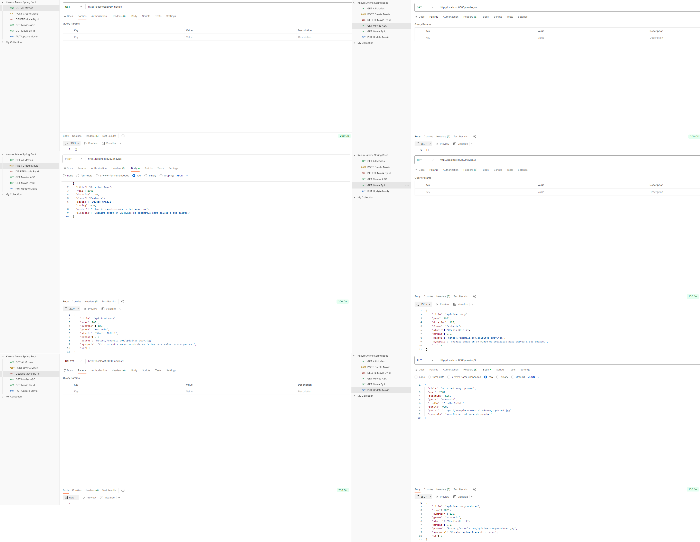

# 🎬 Kakure Anime Spring Back


**English version:** [README.en.md](README.en.md)

## 📌 Descripción


Kakure Anime Spring Back es el backend REST del proyecto Kakure Anime, orientado a la gestión de películas de anime mediante operaciones CRUD sobre la entidad `Movie`. La aplicación está desarrollada con Spring Boot, persiste la información en MySQL y organiza la lógica en una arquitectura por capas clara y mantenible.

El proyecto está pensado para trabajar de forma directa con un frontend React ya integrado, y su funcionamiento se ha validado tanto desde navegador como mediante colecciones de prueba en Postman.

## 🧱 Arquitectura


La arquitectura del backend sigue una separación clásica por capas:

- `controller`: expone los endpoints REST y recibe las peticiones HTTP.
- `service`: concentra la lógica de negocio del CRUD y la ordenación de resultados.
- `repository`: encapsula el acceso a datos mediante `JpaRepository`.
- `model`: define la entidad `Movie` y su mapeo JPA contra la tabla `movies`.
- configuración Spring Boot: `KakureAnimeSpringBackApplication.java` arranca la aplicación y `application.properties` centraliza la configuración de conexión y JPA.

Flujo principal del backend:

`Controller -> Service -> Repository -> Database`

## 🗂️ Estructura del proyecto


```text
docs
├── badges
│   └── jacoco-coverage.svg
└── screenshots
    ├── CoberturaKABS.png
    ├── CRUDpostmanKABS.png
    └── CRUDreactKAF.png

src
├── main
│   ├── java
│   │   └── org
│   │       └── example
│   │           ├── controller
│   │           │   └── MovieController.java
│   │           ├── model
│   │           │   └── Movie.java
│   │           ├── repository
│   │           │   └── MovieRepository.java
│   │           ├── service
│   │           │   └── MovieService.java
│   │           └── KakureAnimeSpringBackApplication.java
│   └── resources
│       ├── application.properties
│       ├── static
│       └── templates
└── test
    ├── java
    │   └── org
    │       └── example
    │           ├── controller
    │           │   └── MovieControllerTest.java
    │           ├── repository
    │           │   └── MovieRepositoryIntegrationTest.java
    │           ├── service
    │           │   └── MovieServiceTest.java
    │           ├── KakureAnimeSpringBackApplicationMainTest.java
    │           └── KakureAnimeSpringBackApplicationTests.java
    └── resources
        └── application-test.properties
```

## ⚙️ Tecnologías


- `Java 25`: lenguaje base del proyecto y versión configurada en Maven.
- `Spring Boot 4.0.4`: arranque de la aplicación, configuración automática y capa web.
- `Spring Data JPA`: persistencia de la entidad `Movie` y acceso al repositorio.
- `MySQL`: base de datos usada para almacenar las películas.
- `Maven`: gestión de dependencias y construcción del proyecto.
- `Postman`: validación manual de endpoints y respuestas del CRUD.
- `Integración con frontend React`: consumo real del backend desde la interfaz cliente.
- `H2`: base de datos en memoria utilizada en los tests de integración.
- `JaCoCo`: generación del reporte de cobertura automatizado.

## 🧠 Modelo de datos


La entidad principal del backend es `Movie`, mapeada con JPA sobre la tabla `movies`. Representa cada película que el sistema puede listar, crear, consultar, actualizar y eliminar.

| Campo | Tipo | Significado |
| --- | --- | --- |
| `id` | `int` | Identificador único autogenerado de la película. |
| `title` | `String` | Título de la película. |
| `year` | `int` | Año de lanzamiento. |
| `duration` | `int` | Duración total en minutos. |
| `genre` | `String` | Género principal de la película. |
| `studio` | `String` | Estudio responsable de la producción. |
| `rating` | `double` | Valoración numérica asignada a la película. |
| `poster` | `String` | Ruta o URL del póster asociado. |
| `synopsis` | `String` | Resumen argumental de la película. |

## 🔌 Endpoints


- `GET /movies`: devuelve el listado completo de películas.
- `GET /movies/{id}`: recupera una película concreta a partir de su identificador y devuelve `404 Not Found` si no existe.
- `POST /movies`: crea una nueva película en la base de datos.
- `PUT /movies/{id}`: actualiza los datos de una película existente y devuelve `404 Not Found` si no existe.
- `DELETE /movies/{id}`: elimina una película por su identificador.
- `GET /movies/asc`: devuelve las películas ordenadas de forma ascendente por `title`.

## 🔄 Flujo CRUD


- Crear -> `POST /movies`
- Leer todas -> `GET /movies`
- Leer por id -> `GET /movies/{id}`
- Actualizar -> `PUT /movies/{id}`
- Eliminar -> `DELETE /movies/{id}`
- Ordenar ascendente -> `GET /movies/asc`

## 🖥️ Integración con el frontend


El backend ya está integrado con el frontend React del ecosistema Kakure Anime y se ha validado su consumo en navegador. La API permite operar sobre el catálogo desde la interfaz visual y está preparada para aceptar peticiones desde `http://localhost:5173`.

Operaciones comprobadas desde el frontend:

- listado de películas
- detalle por elemento
- creación de nuevos registros
- edición de registros existentes
- borrado de películas

Repositorio del frontend: https://github.com/David-Navarro-Oliver/kakureAnime

## 🧪 Validación y pruebas


El backend se ha comprobado en escenarios reales de uso y validación técnica:

- pruebas manuales con Postman sobre todos los endpoints expuestos
- integración real con el frontend React del proyecto
- operaciones CRUD funcionales sobre la entidad `Movie`
- arranque correcto de Spring Boot con conexión activa a MySQL
- prueba de contexto incluida en `KakureAnimeSpringBackApplicationTests`

## 🧪 Tests y cobertura


El proyecto cuenta con una estrategia automatizada de tests orientada a cubrir el comportamiento real del backend sin alterar su lógica. La suite combina pruebas de contexto, unitarias, de capa web e integración con base de datos en memoria para validar el flujo completo del CRUD, y la cobertura se genera de forma automática con JaCoCo.

Tipos de tests implementados:

- `KakureAnimeSpringBackApplicationTests`: verifica la carga del contexto Spring Boot usando el perfil `test`.
- `KakureAnimeSpringBackApplicationMainTest`: comprueba que el punto de entrada delega correctamente en `SpringApplication.run`.
- `MovieServiceTest`: tests unitarios del servicio con Mockito y repositorio mockeado.
- `MovieControllerTest`: tests de la capa web con `@WebMvcTest`, `MockMvc` y `@MockitoBean`.
- `MovieRepositoryIntegrationTest`: prueba de persistencia real con JPA y H2 en memoria.

Herramientas utilizadas:

- `JUnit Jupiter`
- `Mockito`
- `MockMvc`
- `H2`
- `JaCoCo`
- `Maven`

Comandos principales:

```bash
mvn test
mvn verify
```

Dónde consultar la cobertura:

- reporte HTML: `target/site/jacoco/index.html`
- reporte XML: `target/site/jacoco/jacoco.xml`
- reporte CSV: `target/site/jacoco/jacoco.csv`
- recurso visual reutilizable: `docs/badges/jacoco-coverage.svg`

Cobertura del último reporte generado en local:

- `100%` de instrucciones
- `100%` de ramas
- `100%` de líneas

### Vista del reporte de cobertura
Captura del informe HTML de JaCoCo generado tras la última ejecución local de `mvn verify`.



## 📸 Capturas


### Frontend React consumiendo el CRUD de películas
Vista del catálogo de películas en la interfaz React, con registros cargados y acciones disponibles para editar y eliminar.



### Validación del CRUD completo en Postman
Comprobación de los distintos métodos REST del backend con respuestas correctas y estado `200 OK`.



## 🚀 Cómo ejecutar el proyecto


1. Clona el repositorio del backend:

   ```bash
   git clone https://github.com/David-Navarro-Oliver/kakure-anime-spring-back.git
   cd kakure-anime-spring-back
   ```

2. Abre el proyecto en IntelliJ IDEA.
3. Crea una base de datos local en MySQL con el nombre `kakure_anime_db`.
4. Revisa `src/main/resources/application.properties` y configura la conexión a MySQL según tu entorno local.
5. Asegúrate de que la aplicación apunte a una base de datos llamada `kakure_anime_db` y de que las propiedades `spring.datasource.url`, `spring.datasource.username` y `spring.datasource.password` estén ajustadas con tus credenciales locales.
6. Inicia la aplicación ejecutando `KakureAnimeSpringBackApplication`.
7. Prueba los endpoints con Postman para validar el CRUD del backend.
8. Si quieres usar la interfaz cliente, clona y ejecuta el frontend React desde:

   `https://github.com/David-Navarro-Oliver/kakureAnime`

## ✅ Estado actual


El proyecto se encuentra operativo y actualmente soporta un CRUD completo de películas, persistencia en MySQL, integración con frontend React y validación funcional mediante Postman.
También incluye una suite automatizada de tests con cobertura generada mediante JaCoCo.

## 👨‍💻 Autor


**David Navarro**
